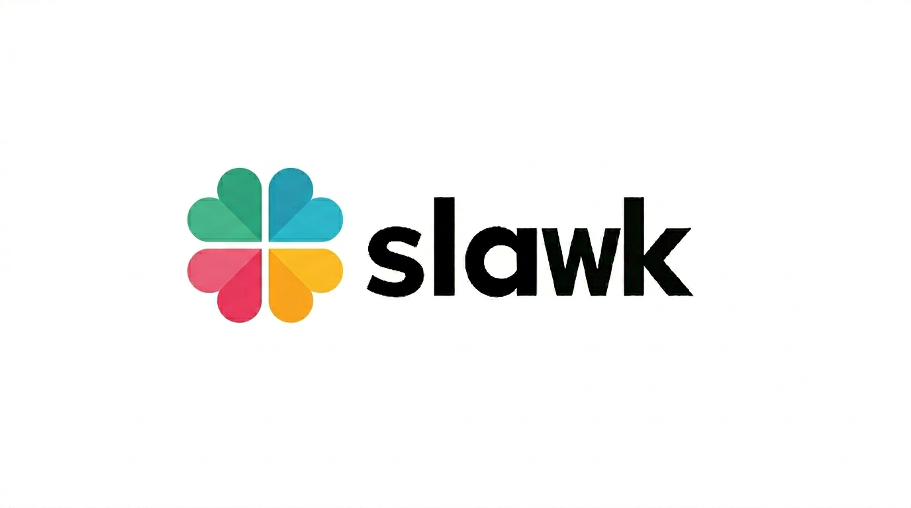
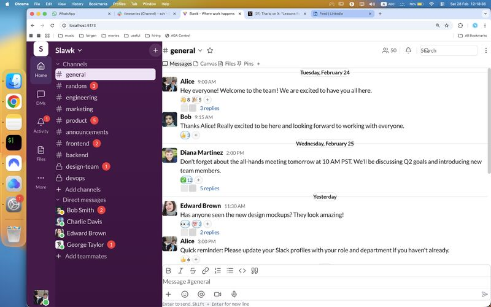
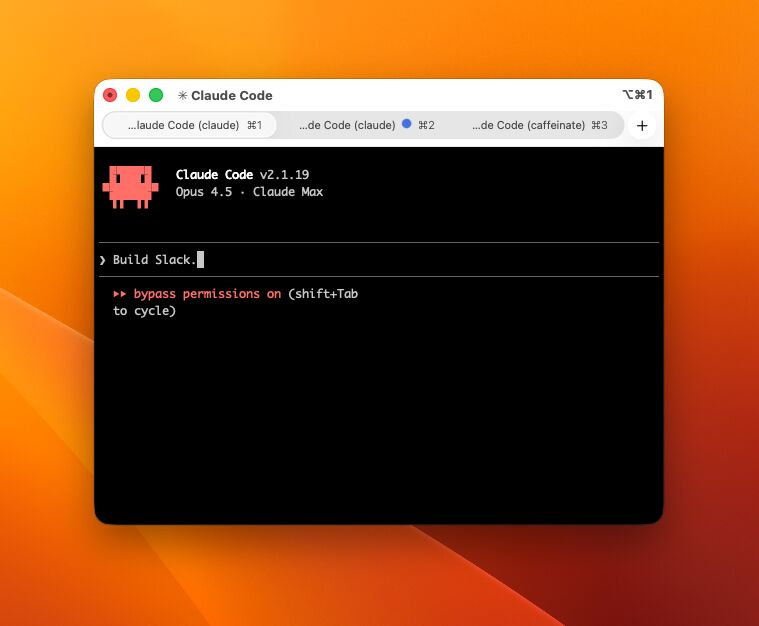

**Slawk** — an open-source Slack clone built in 14 days with Claude Code.

Slack charges $8/user/month. A 50-person org pays $5,000/year. This is the experiment: can any startup self-host a full-featured alternative for $100/year total?

**Stack:** Node.js · PostgreSQL · Prisma · Socket.io · React · Vite · Tailwind

**Features:** Real-time messaging · Channels · DMs · Threads · Reactions · File uploads · Search · Presence

---

## [Day 2](https://www.linkedin.com/posts/nathancavaglione_day-214-cloning-slack-with-claude-code-activity-7433486444993613824-umUt?utm_source=share&utm_medium=member_desktop&rcm=ACoAABo_DiMBthZ8gqvy6PiOdSHUMuPt9XgMnfY)

## [Day 1](https://www.linkedin.com/posts/nathancavaglione_slack-charges-8usermonth-for-a-50-person-activity-7433209073036210176-JcWL?utm_source=share&utm_medium=member_desktop&rcm=ACoAABo_DiMBthZ8gqvy6PiOdSHUMuPt9XgMnfY)

